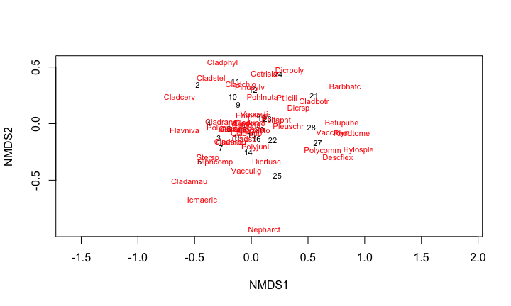
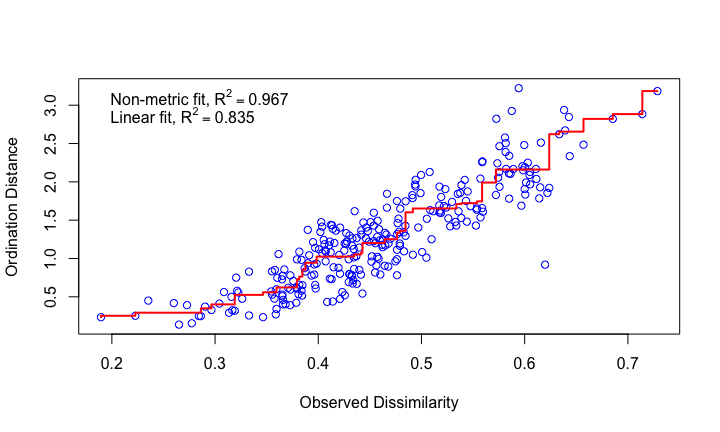
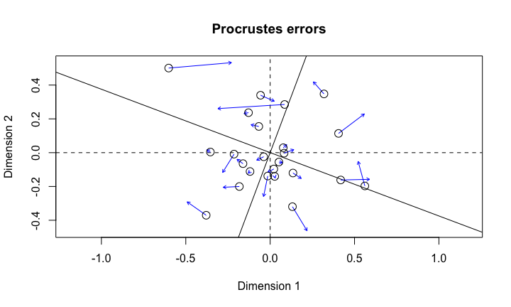
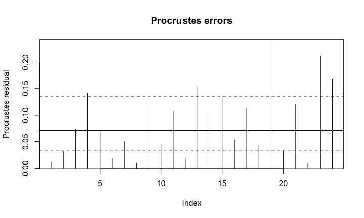
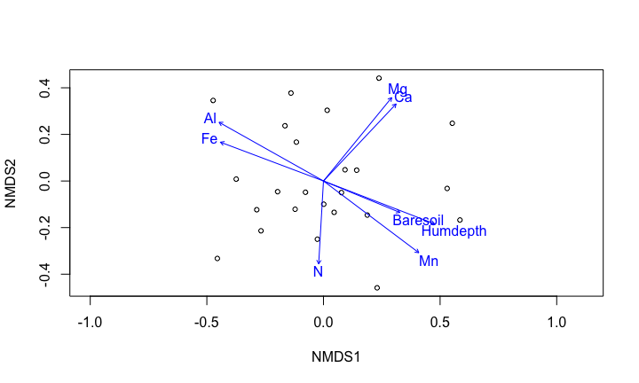
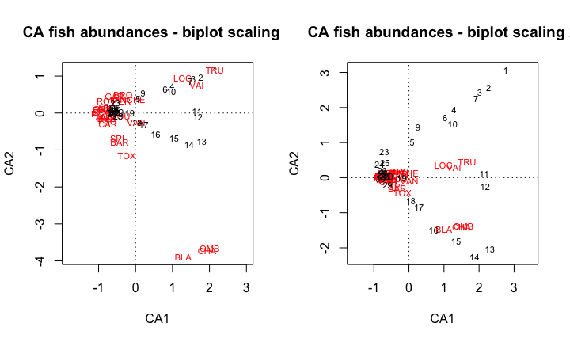
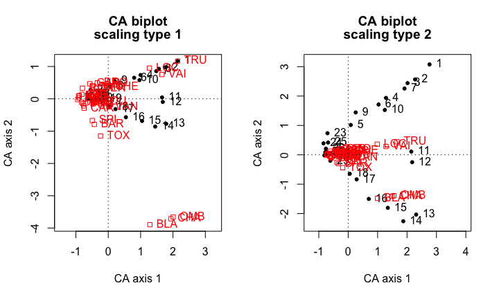

# Chapter-9
Joey and Sean  

## Plan for today
- PCA
- PCoA
- NMDS
- Correspondence analysis

## Load packages and functions


```r
# (vegan must be loaded after ade4 to avoid some conflicts)
library(ade4)
library(vegan)
library(gclus)
library(ape)
```

## Load additional functions

```r
# (files must be in the working directory)
source("evplot.R")
source("cleanplot.pca.R")
source("PCA.R")
source("CA.R")
```

## NMDS
- the objective is to plot dissimilar objects far apart in the ordination space and similar objects close to one another.
- can use any distance matrix
- can deal with missing data
- NMDS is rank based approach which attempts to represent pairwise dissimilarity between objects in low dimensional space 


## NMDS applied to the varespec data: vegetation lichen pastures


```r
data(varespec) ## 44 species, lots of zeros, so  not amenable to PCA
str(varespec)
```

```
## 'data.frame':	24 obs. of  44 variables:
##  $ Callvulg: num  0.55 0.67 0.1 0 0 ...
##  $ Empenigr: num  11.13 0.17 1.55 15.13 12.68 ...
##  $ Rhodtome: num  0 0 0 2.42 0 0 1.55 0 0.35 0.07 ...
##  $ Vaccmyrt: num  0 0.35 0 5.92 0 ...
##  $ Vaccviti: num  17.8 12.1 13.5 16 23.7 ...
##  $ Pinusylv: num  0.07 0.12 0.25 0 0.03 0.12 0.1 0.1 0.05 0.12 ...
##  $ Descflex: num  0 0 0 3.7 0 0.02 0.78 0 0.4 0 ...
##  $ Betupube: num  0 0 0 0 0 0 0.02 0 0 0 ...
##  $ Vacculig: num  1.6 0 0 1.12 0 0 2 0 0.2 0 ...
##  $ Diphcomp: num  2.07 0 0 0 0 0 0 0 0 0.07 ...
##  $ Dicrsp  : num  0 0.33 23.43 0 0 ...
##  $ Dicrfusc: num  1.62 10.92 0 3.63 3.42 ...
##  $ Dicrpoly: num  0 0.02 1.68 0 0.02 0.02 0 0.23 0.2 0 ...
##  $ Hylosple: num  0 0 0 6.7 0 0 0 0 9.97 0 ...
##  $ Pleuschr: num  4.67 37.75 32.92 58.07 19.42 ...
##  $ Polypili: num  0.02 0.02 0 0 0.02 0.02 0 0 0 0 ...
##  $ Polyjuni: num  0.13 0.23 0.23 0 2.12 1.58 0 0.02 0.08 0.02 ...
##  $ Polycomm: num  0 0 0 0.13 0 0.18 0 0 0 0 ...
##  $ Pohlnuta: num  0.13 0.03 0.32 0.02 0.17 0.07 0.1 0.13 0.07 0.03 ...
##  $ Ptilcili: num  0.12 0.02 0.03 0.08 1.8 0.27 0.03 0.1 0.03 0.25 ...
##  $ Barbhatc: num  0 0 0 0.08 0.02 0.02 0 0 0 0.07 ...
##  $ Cladarbu: num  21.73 12.05 3.58 1.42 9.08 ...
##  $ Cladrang: num  21.47 8.13 5.52 7.63 9.22 ...
##  $ Cladstel: num  3.5 0.18 0.07 2.55 0.05 ...
##  $ Cladunci: num  0.3 2.65 8.93 0.15 0.73 0.25 2.38 0.82 0.05 0.95 ...
##  $ Cladcocc: num  0.18 0.13 0 0 0.08 0.1 0.17 0.15 0.02 0.17 ...
##  $ Cladcorn: num  0.23 0.18 0.2 0.38 1.42 0.25 0.13 0.05 0.03 0.05 ...
##  $ Cladgrac: num  0.25 0.23 0.48 0.12 0.5 0.18 0.18 0.22 0.07 0.23 ...
##  $ Cladfimb: num  0.25 0.25 0 0.1 0.17 0.1 0.2 0.22 0.1 0.18 ...
##  $ Cladcris: num  0.23 1.23 0.07 0.03 1.78 0.12 0.2 0.17 0.02 0.57 ...
##  $ Cladchlo: num  0 0 0.1 0 0.05 0.05 0.02 0 0 0.02 ...
##  $ Cladbotr: num  0 0 0.02 0.02 0.05 0.02 0 0 0.02 0.07 ...
##  $ Cladamau: num  0.08 0 0 0 0 0 0 0 0 0 ...
##  $ Cladsp  : num  0.02 0 0 0.02 0 0 0.02 0.02 0 0.07 ...
##  $ Cetreric: num  0.02 0.15 0.78 0 0 0 0.02 0.18 0 0.18 ...
##  $ Cetrisla: num  0 0.03 0.12 0 0 0 0 0.08 0.02 0.02 ...
##  $ Flavniva: num  0.12 0 0 0 0.02 0.02 0 0 0 0 ...
##  $ Nepharct: num  0.02 0 0 0 0 0 0 0 0 0 ...
##  $ Stersp  : num  0.62 0.85 0.03 0 1.58 0.28 0 0.03 0.02 0.03 ...
##  $ Peltapht: num  0.02 0 0 0.07 0.33 0 0 0 0 0.02 ...
##  $ Icmaeric: num  0 0 0 0 0 0 0 0.07 0 0 ...
##  $ Cladcerv: num  0 0 0 0 0 0 0 0 0 0 ...
##  $ Claddefo: num  0.25 1 0.33 0.15 1.97 0.37 0.15 0.67 0.08 0.47 ...
##  $ Cladphyl: num  0 0 0 0 0 0 0 0 0 0 ...
```

## metaMDS - a wrapper function

- Wraps several recommended procedures into one command:
 + takes raw data and performs 'Wisconsin double standardization' (so abundance isn't influencing similarity)
 + calculates specified dissimilarity matrix
 + runs vegan function `monoMDS` many times with random starts, stopping when it finds two similar configurations with minimum stress
 + rotates solution so largest variation of site score is on first axis
 + other details in [vegan tutor](http://cc.oulu.fi/~jarioksa/opetus/metodi/vegantutor.pdf)

## Running NMDS


```r
varespec.nmds.bray <- metaMDS(varespec, distance="bray", trace=FALSE, trymax=100) 
## trace = FALSE, won't show all the outputs, trymax= number of starts
varespec.nmds.bray
```

```
## 
## Call:
## metaMDS(comm = varespec, distance = "bray", trymax = 100, trace = FALSE) 
## 
## global Multidimensional Scaling using monoMDS
## 
## Data:     wisconsin(sqrt(varespec)) 
## Distance: bray 
## 
## Dimensions: 2 
## Stress:     0.1843196 
## Stress type 1, weak ties
## Two convergent solutions found after 10 tries
## Scaling: centring, PC rotation, halfchange scaling 
## Species: expanded scores based on 'wisconsin(sqrt(varespec))'
```


## plotting NMDS


```r
plot(varespec.nmds.bray, type="t")
```

 


## With many variables/sites, ordination plots can quickly become overwhelming
- some built-in function to help include:
 + `make.cepnames` (shortens latin names to 6 char variables)
 + `orditorp` (reduces overlapping points and variable names)
 + `ordilabel` 

## evaluating NMDS mapping


```r
## plots the observed disimilarity values vs. their ordination distance. 
## If NMDS is a good representation of actual values, you'll see a good fit
stressplot(varespec.nmds.bray) 
```

 


## goodness of fit

```r
gof <- goodness(varespec.nmds.bray) # gof for each site. 
plot(varespec.nmds.bray, type="t", main="goodness of fit") 
# larger circles represent plots that don't have a strong fit with original disimilarity matrix.
points(varespec.nmds.bray, display="sites", cex=gof*100)
```

 

## Comparing ordinations

- Comparing different ordinations can be difficult because of slightly
different orientation and scaling. Procrustes rotation using `procrustes` allows comparison

```r
varespec.nmds.eu <- metaMDS(varespec, distance="eu", trace=FALSE, trymax=100) 
# use euclidean distance - probably not a good choice for most community analyses
pro <- procrustes(varespec.nmds.bray, varespec.nmds.eu)
```

## Comparing ordinations


```r
plot(pro, cex=1.5)
```

 

## Comparing ordinations


```r
plot(pro, kind=2) # shows the shift in sites between two ordinations.
```

 

 
## dissimilarity indices

- `metaMDS` automatically standardizes and then calculates specified dissimilarity index
- `vegdist` will take a matrix of sites (rows) and variables/species (columns) and calculate specied dissimilarity index, outputs class `dist`


## Overlaying environmental vectors onto ordination

 - environmental data, paired with `varespec` data

```r
data(varechem)
str(varechem)
```

```
## 'data.frame':	24 obs. of  14 variables:
##  $ N       : num  19.8 13.4 20.2 20.6 23.8 22.8 26.6 24.2 29.8 28.1 ...
##  $ P       : num  42.1 39.1 67.7 60.8 54.5 40.9 36.7 31 73.5 40.5 ...
##  $ K       : num  140 167 207 234 181 ...
##  $ Ca      : num  519 357 973 834 777 ...
##  $ Mg      : num  90 70.7 209.1 127.2 125.8 ...
##  $ S       : num  32.3 35.2 58.1 40.7 39.5 40.8 33.8 27.1 42.5 60.2 ...
##  $ Al      : num  39 88.1 138 15.4 24.2 ...
##  $ Fe      : num  40.9 39 35.4 4.4 3 ...
##  $ Mn      : num  58.1 52.4 32.1 132 50.1 ...
##  $ Zn      : num  4.5 5.4 16.8 10.7 6.6 9.1 7.4 5.2 9.3 9.1 ...
##  $ Mo      : num  0.3 0.3 0.8 0.2 0.3 0.4 0.3 0.3 0.3 0.5 ...
##  $ Baresoil: num  43.9 23.6 21.2 18.7 46 40.5 23 29.8 17.6 29.9 ...
##  $ Humdepth: num  2.2 2.2 2 2.9 3 3.8 2.8 2 3 2.2 ...
##  $ pH      : num  2.7 2.8 3 2.8 2.7 2.7 2.8 2.8 2.8 2.8 ...
```

## Overlaying vectors with envfit


```r
# first two columns are direction cosines of the vectors, and `r2` gives the squared correlation coefficient
# when plotted, vectors should be scaled by square root of `r2`. `plot` does this automatically (see next slide)
# significances (`Pr>r`) are based on  random permutations of the data: if if you often get as good or better R2 with randomly permuted data, your values are insignificant.
fit <- envfit(varespec.nmds.bray, varechem, permu=999)
fit
```

```
## 
## ***VECTORS
## 
##             NMDS1    NMDS2     r2 Pr(>r)    
## N        -0.05038 -0.99873 0.2080  0.100 .  
## P         0.68719  0.72647 0.1755  0.141    
## K         0.82745  0.56155 0.1657  0.153    
## Ca        0.75024  0.66116 0.2809  0.034 *  
## Mg        0.69691  0.71716 0.3492  0.018 *  
## S         0.27645  0.96103 0.1774  0.154    
## Al       -0.83757  0.54633 0.5155  0.001 ***
## Fe       -0.86169  0.50743 0.3999  0.008 ** 
## Mn        0.80219 -0.59707 0.5323  0.002 ** 
## Zn        0.66537  0.74651 0.1779  0.154    
## Mo       -0.84867  0.52892 0.0517  0.564    
## Baresoil  0.87189 -0.48971 0.2494  0.049 *  
## Humdepth  0.92623 -0.37696 0.5590  0.001 ***
## pH       -0.79900  0.60133 0.2625  0.038 *  
## ---
## Signif. codes:  0 '***' 0.001 '**' 0.01 '*' 0.05 '.' 0.1 ' ' 1
## Permutation: free
## Number of permutations: 999
```


## Plotting envfit output

- The arrow points to the direction of most rapid change in the the
environmental variable. Often this is called the direction of the
gradient.
- The length of the arrow is proportional to the correlation between
ordination and environmental variable. Often this is called the
strength of the gradient.


```r
plot(varespec.nmds.bray, display="sites")
plot(fit, p.max=0.05) #only display variables that are significant
```

 

## Other options

- `envfit` also works with factors
- vector fitting implies a linear relationship between ordination and environment
- function `ordisurf` fits surfaces of environmental variables to ordinations based on generalized additive models in function `gam` of package mgcv.
- see vegan tutor or help files for more details.


## Import data

```r
# (files must be in the working directory)
spe <- read.csv("DoubsSpe.csv", row.names=1)
env <- read.csv("DoubsEnv.csv", row.names=1)
spa <- read.csv("DoubsSpa.csv", row.names=1)
# Remove empty site 8
spe <- spe[-8,]
env <- env[-8,]
spa <- spa[-8,]
```

## Intro to CA
- CA is well suited to the analysis of species abundance data without pre-transformation. 

- data submitted to CA must be frequencies or frequency-like, dimensionally homogeneous and non-negative (as is the case of species counts or presence–absence data)

-  raw data are transformed into a matrix Q, of cell-by-cell contributions to the pearson χ 2 statistic

- get an ordination, where the χ 2 distance is preserved among sites instead of the Euclidean distance. The χ 2 distance is not influenced by double zeros

## How CA differs from PCA
- In both PCA and CA the weights are derived by eigenanalysis
- In PCA, the matrix of species abundances is transformed into a matrix of covariances or correlations, each abundance value being replaced by a measure of its correlation (or covariance) with other abundances in other quadrats
- In CA, the abundance data is transformed to a chi-square statistic, which is used to depict the degree associations among sites depart from independence
-  the chi-square metric in CA preserves ecological distance by modeling differences in associations rather than abundances of single species. 

- the system of weights used to score sites or quadrats is derived from a metric of species associations, and the more these associations depart from independence, the further separated final scores will be


## CA of the raw species dataset (original species abundances)

```r
# Compute CA
## things to note: the first axis has a very large eigenvalue. 
## In CA, a value over 0.6 indicate a very strong gradient in the data. 
## Note that the eigenvalues are the same in both scalings. 
## The scaling affects the eigenvectors, not the eigenvalues. 
spe.ca <- cca(spe)
summary(spe.ca)		# default scaling 2
```

```
## 
## Call:
## cca(X = spe) 
## 
## Partitioning of mean squared contingency coefficient:
##               Inertia Proportion
## Total           1.167          1
## Unconstrained   1.167          1
## 
## Eigenvalues, and their contribution to the mean squared contingency coefficient 
## 
## Importance of components:
##                         CA1    CA2     CA3     CA4     CA5     CA6     CA7
## Eigenvalue            0.601 0.1444 0.10729 0.08337 0.05158 0.04185 0.03389
## Proportion Explained  0.515 0.1237 0.09195 0.07145 0.04420 0.03586 0.02904
## Cumulative Proportion 0.515 0.6388 0.73069 0.80214 0.84634 0.88220 0.91124
##                           CA8     CA9    CA10    CA11     CA12     CA13
## Eigenvalue            0.02883 0.01684 0.01083 0.01014 0.007886 0.006123
## Proportion Explained  0.02470 0.01443 0.00928 0.00869 0.006760 0.005250
## Cumulative Proportion 0.93594 0.95038 0.95965 0.96835 0.975100 0.980350
##                           CA14     CA15     CA16     CA17     CA18
## Eigenvalue            0.004867 0.004606 0.003844 0.003067 0.001823
## Proportion Explained  0.004170 0.003950 0.003290 0.002630 0.001560
## Cumulative Proportion 0.984520 0.988470 0.991760 0.994390 0.995950
##                           CA19     CA20      CA21      CA22      CA23
## Eigenvalue            0.001642 0.001295 0.0008775 0.0004217 0.0002149
## Proportion Explained  0.001410 0.001110 0.0007500 0.0003600 0.0001800
## Cumulative Proportion 0.997360 0.998470 0.9992200 0.9995900 0.9997700
##                            CA24      CA25      CA26
## Eigenvalue            0.0001528 8.949e-05 2.695e-05
## Proportion Explained  0.0001300 8.000e-05 2.000e-05
## Cumulative Proportion 0.9999000 1.000e+00 1.000e+00
## 
## Scaling 2 for species and site scores
## * Species are scaled proportional to eigenvalues
## * Sites are unscaled: weighted dispersion equal on all dimensions
## 
## 
## Species scores
## 
##          CA1       CA2      CA3       CA4       CA5       CA6
## CHA  1.50075 -1.410293  0.26049 -0.307203  0.271777 -0.003465
## TRU  1.66167  0.444129  0.57571  0.166073 -0.261870 -0.326590
## VAI  1.28545  0.285328 -0.04768  0.018126  0.043847  0.200732
## LOC  0.98662  0.360900 -0.35265 -0.009021 -0.012231  0.253429
## OMB  1.55554 -1.389752  0.80505 -0.468471  0.471301  0.225409
## BLA  0.99709 -1.479902 -0.48035  0.079397 -0.105715 -0.332445
## HOT -0.54916 -0.051534  0.01123 -0.096004 -0.382763  0.134807
## TOX -0.18478 -0.437710 -0.57438  0.424267 -0.587150  0.091866
## VAN  0.01337 -0.095342 -0.57672  0.212017  0.126668 -0.389103
## CHE  0.01078  0.140577 -0.34811 -0.538268  0.185286  0.167087
## BAR -0.33363 -0.300682 -0.04929  0.170961 -0.157203  0.103068
## SPI -0.38357 -0.255310 -0.20136  0.374057 -0.385866  0.239001
## GOU -0.32152 -0.034382 -0.07423 -0.031236  0.014417 -0.156351
## BRO -0.26165  0.187282  0.00617  0.183771  0.295142 -0.262808
## PER -0.28913  0.121044 -0.18919  0.367615  0.218087 -0.163675
## BOU -0.60298 -0.057369  0.20341  0.214299 -0.050977  0.211926
## PSO -0.58669 -0.082467  0.21198  0.050175 -0.120456  0.108724
## ROT -0.61815  0.124733  0.13339  0.147190  0.317736 -0.340380
## CAR -0.57951 -0.110732  0.20173  0.308547  0.006854  0.153224
## TAN -0.37880  0.138023 -0.07825  0.095793  0.256285 -0.029245
## BCO -0.70235  0.011155  0.40242  0.211582  0.138186  0.132297
## PCH -0.73238 -0.009098  0.55678  0.321852  0.281812  0.172271
## GRE -0.69300  0.038971  0.37688 -0.183965 -0.051945 -0.011126
## GAR -0.44181  0.176915 -0.23691 -0.345104  0.129676 -0.043802
## BBO -0.70928  0.032317  0.40924  0.030224  0.049050  0.114560
## ABL -0.63114  0.053594  0.15204 -0.661381 -0.414796 -0.206611
## ANG -0.63578 -0.041894  0.30093  0.224044  0.030444  0.203160
## 
## 
## Site scores (weighted averages of species scores)
## 
##         CA1       CA2        CA3      CA4      CA5      CA6
## 1   2.76488  3.076306  5.3657489  1.99192 -5.07714 -7.80447
## 2   2.27540  2.565531  1.2659130  0.87538 -1.89139 -0.13887
## 3   2.01823  2.441224  0.5144079  0.79436 -1.03741  0.56015
## 4   1.28485  1.935664 -0.2509482  0.76470  0.54752  0.10579
## 5   0.08875  1.015182 -1.4555434  0.47672  2.69249 -2.92498
## 6   1.03188  1.712163 -0.9544059  0.01584  0.91932  0.39856
## 7   1.91427  2.256208 -0.0001407  0.39844 -1.07017  0.32127
## 9   0.25591  1.443008 -2.5777721 -3.41400  2.36613  2.71741
## 10  1.24517  1.526391 -1.9635663 -0.41230  0.69647  1.51859
## 11  2.14501  0.110278  1.6108693 -0.82023  0.53918  1.01153
## 12  2.17418 -0.251649  1.5845397 -0.81483  0.52623  1.05501
## 13  2.30944 -2.034439  1.9181448 -0.60481  0.64435 -0.14844
## 14  1.87141 -2.262503  1.1066796 -0.80840  1.09542  0.11038
## 15  1.34659 -1.805967 -0.6441505 -0.52803  0.76871 -0.67165
## 16  0.70214 -1.501167 -1.9735888  0.98502 -0.93585 -1.27168
## 17  0.28775 -0.836803 -1.2259108  0.73302 -1.57036  0.57315
## 18  0.05299 -0.647950 -0.9234228  0.35770 -0.95401  0.77738
## 19 -0.20584 -0.007252 -1.0154343  0.07041 -1.03450  0.51442
## 20 -0.57879  0.042849 -0.3660551 -0.15019 -0.61357  0.10115
## 21 -0.67320  0.038875  0.1194956  0.17256 -0.14686 -0.12018
## 22 -0.71933  0.014694  0.2204186  0.13598  0.09459 -0.02068
## 23 -0.70438  0.735398 -0.6546250 -6.61523 -2.49441 -1.73215
## 24 -0.83976  0.390120  0.5605295 -4.38864 -2.56916 -0.96702
## 25 -0.68476  0.418842 -0.2860819 -2.80336 -0.37540 -3.93791
## 26 -0.75808  0.210204  0.5894091 -0.70004 -0.01880 -0.10779
## 27 -0.75046  0.100869  0.5531191 -0.12946  0.29164  0.11280
## 28 -0.77878  0.088976  0.7379012  0.05204  0.40940  0.43236
## 29 -0.60815 -0.203235  0.5522726  0.43621  0.15010  0.25618
## 30 -0.80860 -0.019592  0.6686542  0.88136  0.52744  0.16456
```

```r
summary(spe.ca, scaling=1) 
```

```
## 
## Call:
## cca(X = spe) 
## 
## Partitioning of mean squared contingency coefficient:
##               Inertia Proportion
## Total           1.167          1
## Unconstrained   1.167          1
## 
## Eigenvalues, and their contribution to the mean squared contingency coefficient 
## 
## Importance of components:
##                         CA1    CA2     CA3     CA4     CA5     CA6     CA7
## Eigenvalue            0.601 0.1444 0.10729 0.08337 0.05158 0.04185 0.03389
## Proportion Explained  0.515 0.1237 0.09195 0.07145 0.04420 0.03586 0.02904
## Cumulative Proportion 0.515 0.6388 0.73069 0.80214 0.84634 0.88220 0.91124
##                           CA8     CA9    CA10    CA11     CA12     CA13
## Eigenvalue            0.02883 0.01684 0.01083 0.01014 0.007886 0.006123
## Proportion Explained  0.02470 0.01443 0.00928 0.00869 0.006760 0.005250
## Cumulative Proportion 0.93594 0.95038 0.95965 0.96835 0.975100 0.980350
##                           CA14     CA15     CA16     CA17     CA18
## Eigenvalue            0.004867 0.004606 0.003844 0.003067 0.001823
## Proportion Explained  0.004170 0.003950 0.003290 0.002630 0.001560
## Cumulative Proportion 0.984520 0.988470 0.991760 0.994390 0.995950
##                           CA19     CA20      CA21      CA22      CA23
## Eigenvalue            0.001642 0.001295 0.0008775 0.0004217 0.0002149
## Proportion Explained  0.001410 0.001110 0.0007500 0.0003600 0.0001800
## Cumulative Proportion 0.997360 0.998470 0.9992200 0.9995900 0.9997700
##                            CA24      CA25      CA26
## Eigenvalue            0.0001528 8.949e-05 2.695e-05
## Proportion Explained  0.0001300 8.000e-05 2.000e-05
## Cumulative Proportion 0.9999000 1.000e+00 1.000e+00
## 
## Scaling 1 for species and site scores
## * Sites are scaled proportional to eigenvalues
## * Species are unscaled: weighted dispersion equal on all dimensions
## 
## 
## Species scores
## 
##          CA1      CA2      CA3      CA4      CA5      CA6
## CHA  1.93586 -3.71167  0.79524 -1.06393  1.19669 -0.01694
## TRU  2.14343  1.16888  1.75759  0.57516 -1.15306 -1.59651
## VAI  1.65814  0.75094 -0.14555  0.06277  0.19306  0.98127
## LOC  1.27267  0.94983 -1.07661 -0.03124 -0.05385  1.23887
## OMB  2.00654 -3.65761  2.45774 -1.62244  2.07523  1.10190
## BLA  1.28617 -3.89487 -1.46646  0.27497 -0.46548 -1.62514
## HOT -0.70838 -0.13563  0.03428 -0.33249 -1.68537  0.65900
## TOX -0.23836 -1.15198 -1.75354  1.46935 -2.58533  0.44908
## VAN  0.01724 -0.25092 -1.76067  0.73427  0.55774 -1.90211
## CHE  0.01391  0.36998 -1.06276 -1.86417  0.81585  0.81679
## BAR -0.43036 -0.79135 -0.15048  0.59208 -0.69219  0.50384
## SPI -0.49478 -0.67194 -0.61472  1.29546 -1.69904  1.16834
## GOU -0.41473 -0.09049 -0.22662 -0.10818  0.06348 -0.76431
## BRO -0.33751  0.49290  0.01884  0.63645  1.29957 -1.28472
## PER -0.37296  0.31857 -0.57758  1.27315  0.96028 -0.80011
## BOU -0.77780 -0.15099  0.62098  0.74218 -0.22446  1.03599
## PSO -0.75678 -0.21704  0.64715  0.17377 -0.53039  0.53149
## ROT -0.79737  0.32828  0.40724  0.50976  1.39905 -1.66393
## CAR -0.74752 -0.29143  0.61585  1.06858  0.03018  0.74903
## TAN -0.48862  0.36325 -0.23888  0.33176  1.12847 -0.14296
## BCO -0.90598  0.02936  1.22855  0.73277  0.60846  0.64673
## PCH -0.94471 -0.02395  1.69979  1.11466  1.24087  0.84214
## GRE -0.89392  0.10256  1.15059 -0.63712 -0.22872 -0.05439
## GAR -0.56990  0.46561 -0.72328 -1.19519  0.57099 -0.21413
## BBO -0.91492  0.08505  1.24936  0.10467  0.21598  0.56002
## ABL -0.81412  0.14105  0.46416 -2.29054 -1.82642 -1.01000
## ANG -0.82011 -0.11026  0.91871  0.77593  0.13405  0.99313
## 
## 
## Site scores (weighted averages of species scores)
## 
##         CA1       CA2        CA3       CA4       CA5      CA6
## 1   2.14343  1.168878  1.7575907  0.575155 -1.153061 -1.59651
## 2   1.76398  0.974804  0.4146591  0.252762 -0.429551 -0.02841
## 3   1.56461  0.927572  0.1684981  0.229368 -0.235605  0.11459
## 4   0.99607  0.735478 -0.0821999  0.220804  0.124347  0.02164
## 5   0.06880  0.385730 -0.4767740  0.137649  0.611487 -0.59835
## 6   0.79995  0.650556 -0.3126227  0.004573  0.208785  0.08153
## 7   1.48401  0.857273 -0.0000461  0.115048 -0.243045  0.06572
## 9   0.19839  0.548288 -0.8443683 -0.985772  0.537369  0.55588
## 10  0.96530  0.579970 -0.6431806 -0.119049  0.158175  0.31065
## 11  1.66289  0.041901  0.5276521 -0.236838  0.122453  0.20692
## 12  1.68551 -0.095617  0.5190277 -0.235278  0.119512  0.21582
## 13  1.79036 -0.773009  0.6283025 -0.174635  0.146337 -0.03037
## 14  1.45079 -0.859665  0.3625011 -0.233420  0.248779  0.02258
## 15  1.04393 -0.686198 -0.2109962 -0.152467  0.174580 -0.13740
## 16  0.54432 -0.570386 -0.6464636  0.284420 -0.212539 -0.26014
## 17  0.22308 -0.317953 -0.4015561  0.211655 -0.356642  0.11725
## 18  0.04108 -0.246196 -0.3024740  0.103285 -0.216664  0.15902
## 19 -0.15958 -0.002755 -0.3326130  0.020330 -0.234943  0.10523
## 20 -0.44870  0.016281 -0.1199041 -0.043366 -0.139347  0.02069
## 21 -0.52189  0.014771  0.0391417  0.049826 -0.033352 -0.02458
## 22 -0.55765  0.005583  0.0721997  0.039264  0.021482 -0.00423
## 23 -0.54606  0.279423 -0.2144273 -1.910111 -0.566501 -0.35434
## 24 -0.65102  0.148231  0.1836056 -1.267193 -0.583479 -0.19782
## 25 -0.53085  0.159144 -0.0937082 -0.809453 -0.085257 -0.80556
## 26 -0.58769  0.079869  0.1930653 -0.202133 -0.004271 -0.02205
## 27 -0.58178  0.038326  0.1811782 -0.037380  0.066234  0.02307
## 28 -0.60374  0.033808  0.2417050  0.015027  0.092978  0.08844
## 29 -0.47146 -0.077222  0.1809010  0.125954  0.034090  0.05241
## 30 -0.62686 -0.007444  0.2190226  0.254487  0.119787  0.03366
```
## Scaling options
- when scaling = 1 the distances among objects approximate their x2 distances (i.e. object points close together are similar in their species frequencies). Any object near the point representing a species is likely to contain a high contribution of that species. 

- when scaling = 2, ordination of species. Species points close to one another are likely to have similar relative frequencies among objects. 


## Plot eigenvalues and % of variance for each axis

```r
ev2 <- spe.ca$CA$eig
```
## plot 

```r
## things to note: the first axis is extremely dominant. 
evplot(ev2)
```

 


## CA biplots

```r
par(mfrow=c(1,2))
# Scaling 1: sites are centroids of species
plot(spe.ca, scaling=1, main="CA fish abundances - biplot scaling 1")
# Scaling 2 (default): species are centroids of sites
plot(spe.ca, main="CA fish abundances - biplot scaling 2")
```

 
## A posteriori projection of environmental variables in a CA
-envfit finds vectors or factor averages of environmental variables. [...] The projections of points onto vectors have maximum correlation with corresponding environmental variables, and the factors show the averages of factor levels”
	
## CA biplot (scaling 2) of the Doubs fish abundance data with a posteriori projection of environmental variables


```r
# The last plot produced (CA scaling 2) must be active
plot(spe.ca, main="CA fish abundances - biplot scaling 2")
(spe.ca.env <- envfit(spe.ca, env))
```

```
## 
## ***VECTORS
## 
##          CA1      CA2     r2 Pr(>r)    
## das -0.94801 -0.31825 0.6889  0.001 ***
## alt  0.81141  0.58448 0.8080  0.001 ***
## pen  0.73753  0.67531 0.2976  0.006 ** 
## deb -0.92837 -0.37166 0.4440  0.001 ***
## pH   0.50723 -0.86181 0.0908  0.243    
## dur -0.71728 -0.69678 0.4722  0.002 ** 
## pho -0.99897  0.04533 0.1757  0.087 .  
## nit -0.94906 -0.31511 0.4510  0.002 ** 
## amm -0.97495  0.22241 0.1762  0.080 .  
## oxy  0.93352 -0.35854 0.6263  0.001 ***
## dbo -0.94094  0.33857 0.2237  0.030 *  
## ---
## Signif. codes:  0 '***' 0.001 '**' 0.01 '*' 0.05 '.' 0.1 ' ' 1
## Permutation: free
## Number of permutations: 999
```

```r
plot(spe.ca.env)
# Plot significant variables with a different colour
plot(spe.ca.env, p.max=0.05, col=3)
```

 

## Species data table ordered after the CA result


```r
vegemite(spe, spe.ca)
```

```
##                                   
##      2322222222211  11 1 11  11 1 
##      40867235190985976604547312231
##  PCH .53122..14...................
##  BBO 155244..3421.................
##  BCO .53234..3411.................
##  GRE 255454.135211................
##  ANG .54232..24211..1.............
##  ABL 5555552355532..2.............
##  ROT .52112.12221.2...............
##  BOU .54233..35322..1.............
##  PSO 134233..25211..11............
##  CAR .54123..23111..11............
##  HOT 111113..22221..1.............
##  GAR 255455115555254211...........
##  SPI .51111..23323..41............
##  TAN .54354..4342131112.11........
##  BAR .33245..45423..32...21.......
##  GOU 154345.2554422.1211121.......
##  PER .52114..342134.211.2.........
##  BRO .43243.1352114.111.2.1.1.....
##  TOX .21.12..22233..44............
##  CHE 23423411243132522221311.11...
##  VAN .32123.1232225.3512.3.1......
##  LOC ..1111..11253234554554551432.
##  BLA .........1.11..25...43.....2.
##  VAI ........11133314344545454445.
##  CHA ............1..12...33..12.2.
##  OMB .........1..1..1....24..12.3.
##  TRU .........1..12.23314455535553
##   sites species 
##      29      27
```

## CA using CA() function

```r
# Ordering of the data table following the first CA axis
# The table is transposed, as in vegemite() output
spe.CA.PL <- CA(spe)
biplot(spe.CA.PL, cex=1)
```

 

## useful links
- [PCA vs CA?](http://stats.stackexchange.com/questions/70533/using-principal-components-analysis-vs-correspondence-analysis)
