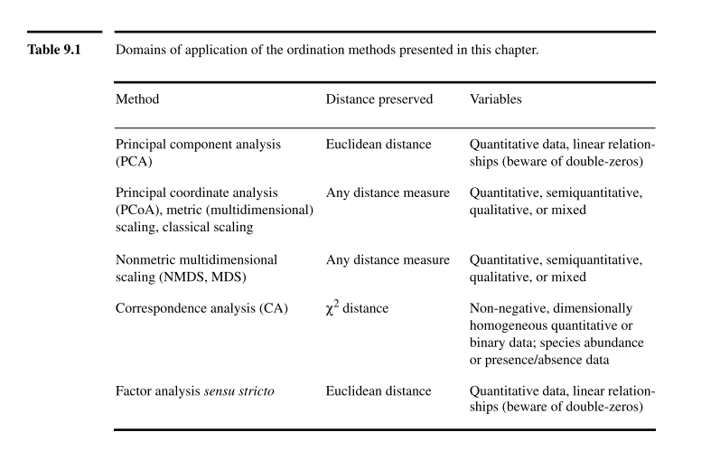
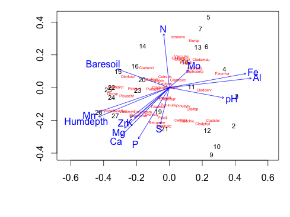

## Setup
cleanplot.pca 
[From]: (http://www.davidzeleny.net/anadat-r/doku.php/en:numecolr:cleanplot.pca)
packages needed: vegan, MASS
```{r, echo=FALSE, message=FALSE, warning=FALSE}
# We'll work out of the vegan package
require(vegan)
require(MASS)
```

## Introduction to Ordination
* Projects multidimensional variation onto bivariate plots
* Axes represent a large fraction of the variability in a multi-dimensional data matrix
* Can derive quantitative information on the relationships among descriptors and among objects 


## Summary of Methods
* Principal Components Analysis
* Principal Coordinates Analysis
* Non-metric Muldimensional Scaling
* Correspondance Analysis

## Summary of Methods



## Principal Components Analysis 
* For quantitative data
* Assumes multi-normal distribution and linear relationships among descriptors
* Sensitive to double zero problem

## Properties of Principal Components
* Orthogonal - axes are totally independent from each other
* eigenvalues represent the amount of variance of each successive axis
* Can summarize the variability of a large number of descriptors in a small number of dimensions

```{r, echo=FALSE}
"cleanplot.pca" <- function(res.pca, ax1=1, ax2=2, point=FALSE, 
	ahead=0.07, cex=0.7) 
{
# A function to draw two biplots (scaling 1 and scaling 2) from an object 
# of class "rda" (PCA or RDA result from vegan's rda() function)
#
# License: GPL-2 
# Authors: Francois Gillet & Daniel Borcard, 24 August 2012
 
	require("vegan")
 
	par(mfrow=c(1,2))
	p <- length(res.pca$CA$eig)
 
	# Scaling 1: "species" scores scaled to relative eigenvalues
	sit.sc1 <- scores(res.pca, display="wa", scaling=1, choices=c(1:p))
	spe.sc1 <- scores(res.pca, display="sp", scaling=1, choices=c(1:p))
	plot(res.pca, choices=c(ax1, ax2), display=c("wa", "sp"), type="n", 
		main="PCA - scaling 1", scaling=1)
	if (point)
	{
		points(sit.sc1[,ax1], sit.sc1[,ax2], pch=20)
		text(res.pca, display="wa", choices=c(ax1, ax2), cex=cex, pos=3, scaling=1)
	}
	else
	{
		text(res.pca, display="wa", choices=c(ax1, ax2), cex=cex, scaling=1)
	}
	text(res.pca, display="sp", choices=c(ax1, ax2), cex=cex, pos=4, 
		col="red", scaling=1)
	arrows(0, 0, spe.sc1[,ax1], spe.sc1[,ax2], length=ahead, angle=20, col="red")
	pcacircle(res.pca)
 
	# Scaling 2: site scores scaled to relative eigenvalues
	sit.sc2 <- scores(res.pca, display="wa", choices=c(1:p))
	spe.sc2 <- scores(res.pca, display="sp", choices=c(1:p))
	plot(res.pca, choices=c(ax1,ax2), display=c("wa","sp"), type="n", 
		main="PCA - scaling 2")
	if (point) {
		points(sit.sc2[,ax1], sit.sc2[,ax2], pch=20)
		text(res.pca, display="wa", choices=c(ax1 ,ax2), cex=cex, pos=3)
	}
	else
	{
		text(res.pca, display="wa", choices=c(ax1, ax2), cex=cex)
	}
	text(res.pca, display="sp", choices=c(ax1, ax2), cex=cex, pos=4, col="red")
	arrows(0, 0, spe.sc2[,ax1], spe.sc2[,ax2], length=ahead, angle=20, col="red")
}
 
 
 
"pcacircle" <- function (pca) 
{
# Draws a circle of equilibrium contribution on a PCA plot 
# generated from a vegan analysis.
# vegan uses special constants for its outputs, hence 
# the 'const' value below.
 
	eigenv <- pca$CA$eig
	p <- length(eigenv)
	n <- nrow(pca$CA$u)
	tot <- sum(eigenv)
	const <- ((n - 1) * tot)^0.25
	radius <- (2/p)^0.5
	radius <- radius * const
	symbols(0, 0, circles=radius, inches=FALSE, add=TRUE, fg=2)
}
```

## PCA in vegan
Using the dataset varechem - availabile in vegan. Environmental variables measured at 25 sites
```{r, echo=FALSE}
data(varechem)
head(varechem)
```

Running the PCA with the function rda. The argument *Scale=TRUE* specifies a correlation matrix, since variables are on different scales.
```{r}
pca <- rda(varechem, scale=TRUE)
```


## The Output

```{r}
summary(pca)
```

## Loadings of descriptors and positions of objects
```{r}
loadings <- scores(pca,choices=c(1,2))
loadings
##use the argument display="species" OR "sites" 
```

## Visualizing PCA
### Scaling - Two ways to project objects and descriptors in reduced space
### Distance bi-plot (Scaling=1)
* eigenvectors scaled to length, principle components scaled to variance
* Distances among objects approximate Euclidean distances in multi-dimensional space
* Length of descriptor describes its contribution to axes
* Angles among descriptor vectors are meaningless

### Correlation bi-plot (Scaling=2)
* Scaled to the square root of the variance
* Angles between descriptors reflect their correlations
* Descriptor lengths approximate their standard deviations
* Distance among objects do NOT approximate their Euclidean distances


## Plotting
```{r}
cleanplot.pca(pca)
```

## Diagnostic Plots
### How to determine what PC-axes are meaningful??
1) Arbitrarily choose variance cut-off
2) Broken Stick Model
3) K-G Criteria
```{r}
screeplot(pca, bstick=TRUE)
ev <- pca$CA$eig
abline(h=mean(ev))
```

### Principal Coordinates Analysis
- Similar to PCA but can use any distance matrix
- Obtains a Euclidean representation of a set of objects whose relationships are measured by any distance or similarity coefficient
- Can accomodate data of mixed precision
- Original variables related *post hoc*

### Calculating PCoA
- Similar to PCA- scaled eigenvectors and eigenvalues based on a distance matrix
- Proof that PCoA on a Euclidean distance matrix is exactly the same as PCA on a covariance matrix of the same data. This time using the base function princomp...
```{r}

pca2 <- princomp(varechem[2:9], cor=FALSE, scores=TRUE)
vare.edist <- vegdist(varechem[2:9], method="euclidean")
pcoa <- cmdscale(vare.edist, eig=TRUE)

## Comparing the scores
pca2$scores[,1]
pcoa$points[,1]
```

## PCoA Example
varespec data set from vegan package. 44 species measured across 24 sites
```{r, warning=FALSE}
data(varespec)
### First, choose appropriate distance matrix - Bray-Curtis used in this example
vare.dist <- vegdist(varespec, method="bray")
### Principle Coordinates Analysis using cmdscale function

vpcoa <- cmdscale(vare.dist, eig=TRUE)
ordiplot(scores(vpcoa),display="sites", type="t")
## Plot the coordinates of species
species.scores <- wascores(vpcoa$points[,1:2], varespec)
text(species.scores, rownames(species.scores), cex=0.4, col="red")
```

## Post-Hoc Projections of environmental variables
- envfit in vegan projects points onto vectors that have maximum correlation with corresponding environmental variables 
```{r, warning=FALSE, error=TRUE}
data("varechem")
vpcoa.env <- envfit(vpcoa, varechem)
plot(vpcoa.env, add=TRUE)
vpcoa.env
```


## How well are distances preserved
- Shepard Diagram tests association between original distances and distances projected in ordination space.
```{r}
Shep.test <- Shepard(vare.dist, vpcoa$points)
plot(Shep.test)
## Alternative is a built in "goodness of fit" test
vpcoa$GOF
```

## Other issues with PCoA
- Non-Euclideanarity
Some resemblance matrices do not allow Euclidean representation of objects resulting in negative eigenvalues
- Solution is to either transform data OR add scaling constant to non-diagonal matrix elements
argument *add=TRUE* in cmdscale