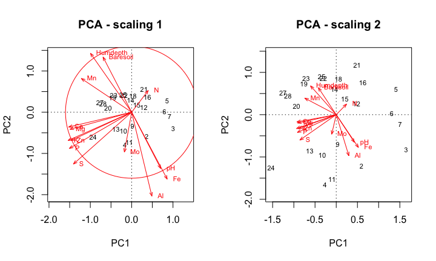
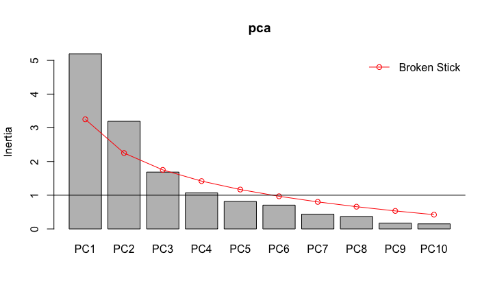
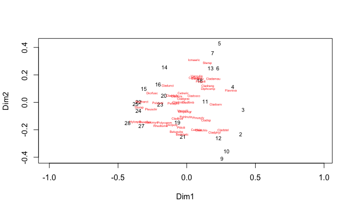
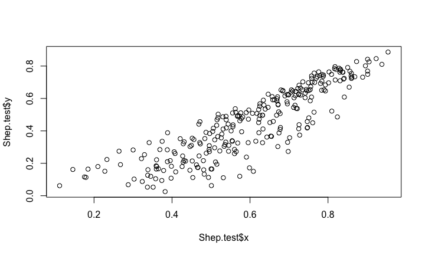

# Chapter 9 Ordination in Reduced Space
Joey and Sean  
5 Feb 2016  

## Setup
cleanplot.pca 
[From]: (http://www.davidzeleny.net/anadat-r/doku.php/en:numecolr:cleanplot.pca)
packages needed: vegan, MASS


## Introduction to Ordination
* Projects multidimensional variation onto bivariate plots
* Axes represent a large fraction of the variability in a multi-dimensional data matrix
* Can derive quantitative information on the relationships among descriptors and among objects 


## Summary of Methods
* Principal Components Analysis
* Principal Coordinates Analysis
* Non-metric Muldimensional Scaling
* Correspondance Analysis

## Summary of Methods


## Principal Components Analysis 
* For quantitative data
* Assumes multi-normal distribution and linear relationships among descriptors
* Sensitive to double zero problem

## Properties of Principal Components
* Orthogonal - axes are totally independent from each other
* eigenvalues represent the amount of variance of each successive axis
* Can summarize the variability of a large number of descriptors in a small number of dimensions


## PCA in vegan
Using the dataset varechem - availabile in vegan. Environmental variables measured at 25 sites

```
##       N    P     K    Ca    Mg    S    Al   Fe    Mn   Zn  Mo Baresoil
## 18 19.8 42.1 139.9 519.4  90.0 32.3  39.0 40.9  58.1  4.5 0.3     43.9
## 15 13.4 39.1 167.3 356.7  70.7 35.2  88.1 39.0  52.4  5.4 0.3     23.6
## 24 20.2 67.7 207.1 973.3 209.1 58.1 138.0 35.4  32.1 16.8 0.8     21.2
## 27 20.6 60.8 233.7 834.0 127.2 40.7  15.4  4.4 132.0 10.7 0.2     18.7
## 23 23.8 54.5 180.6 777.0 125.8 39.5  24.2  3.0  50.1  6.6 0.3     46.0
## 19 22.8 40.9 171.4 691.8 151.4 40.8 104.8 17.6  43.6  9.1 0.4     40.5
##    Humdepth  pH
## 18      2.2 2.7
## 15      2.2 2.8
## 24      2.0 3.0
## 27      2.9 2.8
## 23      3.0 2.7
## 19      3.8 2.7
```

Running the PCA with the function rda. The argument *Scale=TRUE* specifies a correlation matrix, since variables are on different scales.

```r
pca <- rda(varechem, scale=TRUE)
```


## The Output


```r
summary(pca)
```

```
## 
## Call:
## rda(X = varechem, scale = TRUE) 
## 
## Partitioning of correlations:
##               Inertia Proportion
## Total              14          1
## Unconstrained      14          1
## 
## Eigenvalues, and their contribution to the correlations 
## 
## Importance of components:
##                          PC1    PC2    PC3     PC4     PC5     PC6     PC7
## Eigenvalue            5.1916 3.1928 1.6855 1.06899 0.81599 0.70581 0.43641
## Proportion Explained  0.3708 0.2281 0.1204 0.07636 0.05829 0.05042 0.03117
## Cumulative Proportion 0.3708 0.5989 0.7193 0.79564 0.85392 0.90434 0.93551
##                           PC8    PC9    PC10    PC11    PC12    PC13
## Eigenvalue            0.36884 0.1707 0.14953 0.08526 0.06986 0.03506
## Proportion Explained  0.02635 0.0122 0.01068 0.00609 0.00499 0.00250
## Cumulative Proportion 0.96185 0.9740 0.98473 0.99082 0.99581 0.99831
##                          PC14
## Eigenvalue            0.02362
## Proportion Explained  0.00169
## Cumulative Proportion 1.00000
## 
## Scaling 2 for species and site scores
## * Species are scaled proportional to eigenvalues
## * Sites are unscaled: weighted dispersion equal on all dimensions
## * General scaling constant of scores:  4.236078 
## 
## 
## Species scores
## 
##              PC1     PC2      PC3      PC4       PC5      PC6
## N         0.2441  0.2516 -0.23818  0.92846 -0.359554  0.30319
## P        -0.9181 -0.4194  0.13356  0.09649  0.224909  0.07938
## K        -0.9369 -0.3272 -0.06261  0.25051  0.180899 -0.28683
## Ca       -0.9280 -0.1711  0.47982 -0.02138 -0.241479 -0.09536
## Mg       -0.9087 -0.1978  0.12446 -0.04430 -0.497428 -0.10781
## S        -0.8576 -0.6002 -0.31620 -0.01652  0.071629 -0.08779
## Al        0.2980 -0.9720 -0.39009  0.09092  0.005386 -0.19467
## Fe        0.5236 -0.7748 -0.23063  0.37187 -0.023377 -0.32292
## Mn       -0.7418  0.3908  0.13114  0.44346  0.501064  0.06776
## Zn       -0.8926 -0.3277  0.06142 -0.06121 -0.153677  0.51653
## Mo       -0.1072 -0.4625 -0.85720 -0.27258 -0.030063  0.39721
## Baresoil -0.4218  0.6387 -0.40089 -0.07389 -0.416610 -0.31060
## Humdepth -0.6070  0.6825 -0.41674  0.02975 -0.047738 -0.15923
## pH        0.4286 -0.6517  0.66384  0.07599 -0.265374  0.05070
## 
## 
## Site scores (weighted sums of species scores)
## 
##         PC1      PC2       PC3      PC4       PC5      PC6
## 18  0.05126  0.84085 -0.190142 -0.40431  0.101518 -1.01997
## 15  0.20452  0.37397  0.002978 -1.06030  1.175734 -0.92257
## 24 -1.53647 -1.25830 -0.012170 -0.86690 -1.854372  1.74375
## 27 -1.25643  0.51345  0.743928  0.63835  1.097881  0.15631
## 23 -0.71203  0.86247 -0.203389 -0.05971 -0.786196 -0.80080
## 19 -0.76179  0.73785 -0.761645 -0.31728 -1.303297 -0.62264
## 22 -0.30340  0.86304  0.188484  0.54758 -0.078064  0.24567
## 16  0.62797  0.76436 -0.124301 -0.26047  0.009044 -0.02807
## 28 -1.13923  0.44909  0.229104  1.61582  0.842871  0.60852
## 13 -0.62483 -0.85407 -1.259755  1.38195 -0.157593 -1.04794
## 14 -0.04206  0.60916 -0.719743 -0.73109 -0.230147  0.25505
## 20 -0.93747  0.20753 -0.689713  0.62198 -0.282188  0.33232
## 25 -0.34451  0.90128  0.710714  0.64127  1.214897  0.48173
## 7   1.50502 -0.22114 -0.495604  0.87068 -0.769266 -0.25733
## 5   1.40889  0.60035  0.911463  0.71133 -0.488111  2.45195
## 6   1.30776  0.03604 -0.243884 -0.87792  0.543259  0.46876
## 3   1.64967 -0.82755 -0.343406  1.40028 -0.546374 -0.19580
## 4  -0.26711 -1.65198 -1.744251 -0.60763  0.947492  0.46203
## 2   0.59653 -1.21610 -0.200030  0.72815  0.799208 -0.76013
## 9   0.03271 -0.69445 -0.350028 -1.35247  0.717140  0.82965
## 12  0.47944  0.26377  0.184677 -1.27744  0.573929  0.07253
## 10 -0.32993 -0.95483  1.670469 -0.51343  0.819138 -0.48682
## 11 -0.09921 -1.52318  2.493913 -0.09044 -1.092296 -1.10654
## 21  0.49069  1.17838  0.202333 -0.73801 -1.254205 -0.85966
```

## Loadings of descriptors and positions of objects

```r
loadings <- scores(pca,choices=c(1,2))
loadings
```

```
## $species
##                 PC1        PC2
## N         0.2440979  0.2515733
## P        -0.9180524 -0.4193826
## K        -0.9368729 -0.3271677
## Ca       -0.9280154 -0.1710871
## Mg       -0.9087391 -0.1977676
## S        -0.8576285 -0.6001923
## Al        0.2979981 -0.9719998
## Fe        0.5236461 -0.7748245
## Mn       -0.7417951  0.3908124
## Zn       -0.8926155 -0.3276820
## Mo       -0.1071693 -0.4625158
## Baresoil -0.4217537  0.6386581
## Humdepth -0.6070224  0.6824708
## pH        0.4285669 -0.6517311
## 
## $sites
##            PC1         PC2
## 18  0.05125774  0.84085141
## 15  0.20451664  0.37396845
## 24 -1.53646532 -1.25829807
## 27 -1.25642818  0.51344912
## 23 -0.71203013  0.86246533
## 19 -0.76179163  0.73785383
## 22 -0.30339881  0.86303581
## 16  0.62797317  0.76435889
## 28 -1.13922500  0.44909361
## 13 -0.62483096 -0.85407334
## 14 -0.04205762  0.60916369
## 20 -0.93747058  0.20753216
## 25 -0.34450969  0.90128283
## 7   1.50502072 -0.22114340
## 5   1.40888836  0.60035498
## 6   1.30776410  0.03603859
## 3   1.64966903 -0.82755080
## 4  -0.26710838 -1.65197820
## 2   0.59652585 -1.21609676
## 9   0.03271338 -0.69445160
## 12  0.47943679  0.26377399
## 10 -0.32992544 -0.95482574
## 11 -0.09921276 -1.52318433
## 21  0.49068874  1.17837957
## 
## attr(,"const")
## [1] 4.236078
```

```r
##use the argument display="species" OR "sites" 
```

## Visualizing PCA
### Scaling - Two ways to project objects and descriptors in reduced space
### Distance bi-plot (Scaling=1)
* eigenvectors scaled to length, principle components scaled to variance
* Distances among objects approximate Euclidean distances in multi-dimensional space
* Length of descriptor describes its contribution to axes
* Angles among descriptor vectors are meaningless

### Correlation bi-plot (Scaling=2)
* Scaled to the square root of the variance
* Angles between descriptors reflect their correlations
* Descriptor lengths approximate their standard deviations
* Distance among objects do NOT approximate their Euclidean distances


## Plotting

```r
cleanplot.pca(pca)
```

 

## Diagnostic Plots
### How to determine what PC-axes are meaningful??
1) Arbitrarily choose variance cut-off
2) Broken Stick Model
3) K-G Criteria

```r
screeplot(pca, bstick=TRUE)
ev <- pca$CA$eig
abline(h=mean(ev))
```

 

### Principal Coordinates Analysis
- Similar to PCA but can use any distance matrix
- Obtains a Euclidean representation of a set of objects whose relationships are measured by any distance or similarity coefficient
- Can accomodate data of mixed precision
- Original variables related *post hoc*

### Calculating PCoA
- Similar to PCA- scaled eigenvectors and eigenvalues based on a distance matrix
- Proof that PCoA on a Euclidean distance matrix is exactly the same as PCA on a covariance matrix of the same data. This time using the base function princomp...

```r
pca2 <- princomp(varechem[2:9], cor=FALSE, scores=TRUE)
vare.edist <- vegdist(varechem[2:9], method="euclidean")
pcoa <- cmdscale(vare.edist, eig=TRUE)

## Comparing the scores
pca2$scores[,1]
```

```
##         18         15         24         27         23         19 
##   37.04104  197.63767 -412.93625 -298.18502 -227.46280 -134.46642 
##         22         16         28         13         14         20 
## -186.41933  167.40306 -216.74231   26.90069   50.30542 -179.99686 
##         25          7          5          6          3          4 
##  -96.83270  415.20647  330.01086  329.78975  395.46834   85.94756 
##          2          9         12         10         11         21 
##  168.94957   85.03834   97.92660 -144.45949 -567.71964   77.59543
```

```r
pcoa$points[,1]
```

```
##         18         15         24         27         23         19 
##   37.04104  197.63767 -412.93625 -298.18502 -227.46280 -134.46642 
##         22         16         28         13         14         20 
## -186.41933  167.40306 -216.74231   26.90069   50.30542 -179.99686 
##         25          7          5          6          3          4 
##  -96.83270  415.20647  330.01086  329.78975  395.46834   85.94756 
##          2          9         12         10         11         21 
##  168.94957   85.03834   97.92660 -144.45949 -567.71964   77.59543
```

## PCoA Example
varespec data set from vegan package. 44 species measured across 24 sites

```r
data(varespec)
### First, choose appropriate distance matrix - Bray-Curtis used in this example
vare.dist <- vegdist(varespec, method="bray")
### Principle Coordinates Analysis using cmdscale function

vpcoa <- cmdscale(vare.dist, eig=TRUE)
ordiplot(scores(vpcoa),display="sites", type="t")
## Plot the coordinates of species
species.scores <- wascores(vpcoa$points[,1:2], varespec)
text(species.scores, rownames(species.scores), cex=0.4, col="red")
```

 

## Post-Hoc Projections of environmental variables
- envfit in vegan projects points onto vectors that have maximum correlation with corresponding environmental variables 

```r
data("varechem")
vpcoa.env <- envfit(vpcoa, varechem)
plot(vpcoa.env, add=TRUE)
```

```
## Error in strwidth(labels, ...): plot.new has not been called yet
```

```r
vpcoa.env
```

```
## 
## ***VECTORS
## 
##              Dim1     Dim2     r2 Pr(>r)    
## N        -0.10389  0.99459 0.2256  0.068 .  
## P        -0.51674 -0.85614 0.2751  0.036 *  
## K        -0.75049 -0.66089 0.1650  0.145    
## Ca       -0.70536 -0.70885 0.3573  0.010 ** 
## Mg       -0.74131 -0.67116 0.2806  0.035 *  
## S        -0.24233 -0.97019 0.1077  0.298    
## Al        0.99351  0.11375 0.5200  0.002 ** 
## Fe        0.98351  0.18086 0.4622  0.001 ***
## Mn       -0.94534 -0.32608 0.4412  0.004 ** 
## Zn       -0.78962 -0.61359 0.1892  0.111    
## Mo        0.74137  0.67109 0.0503  0.605    
## Baresoil -0.94157  0.33682 0.2339  0.058 .  
## Humdepth -0.92379 -0.38291 0.4487  0.003 ** 
## pH        0.98276 -0.18489 0.2355  0.052 .  
## ---
## Signif. codes:  0 '***' 0.001 '**' 0.01 '*' 0.05 '.' 0.1 ' ' 1
## Permutation: free
## Number of permutations: 999
```


## How well are distances preserved
- Shepard Diagram tests association between original distances and distances projected in ordination space.

```r
Shep.test <- Shepard(vare.dist, vpcoa$points)
plot(Shep.test)
```

 

```r
## Alternative is a built in "goodness of fit" test
vpcoa$GOF
```

```
## [1] 0.5706160 0.6013788
```

## Other issues with PCoA
- Non-Euclideanarity
Some resemblance matrices do not allow Euclidean representation of objects resulting in negative eigenvalues
- Solution is to either transform data OR add scaling constant to non-diagonal matrix elements
argument *add=TRUE* in cmdscale
