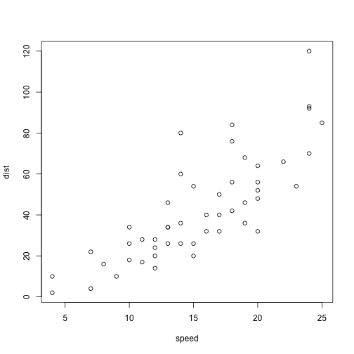

Numerical Ecology Chapter 9
========================================================
author: Joey Bernhardt
date: January 31 2016

Plan for today
========================================================

- PCA
- PCoA
- NMDS
- Correspondence analysis

Slide With Code
========================================================


```r
summary(cars)
```

```
     speed           dist       
 Min.   : 4.0   Min.   :  2.00  
 1st Qu.:12.0   1st Qu.: 26.00  
 Median :15.0   Median : 36.00  
 Mean   :15.4   Mean   : 42.98  
 3rd Qu.:19.0   3rd Qu.: 56.00  
 Max.   :25.0   Max.   :120.00  
```

Goals of ordination
========================================================

- represent the data along a reduced number of orthogonal axes, constructed in such a way that they represent, in decreasing order, the main trends of the data


Ordination
========================================================

- Imagine an n × p data set containing n objects and p variables


Slide With Plot
========================================================

 
